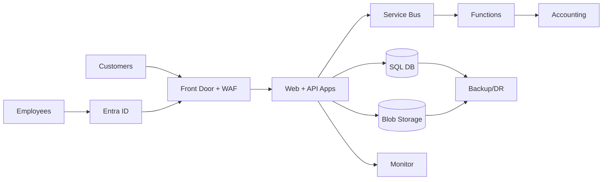

# assignment2_cloudcomputing_diagram

```mermaid
flowchart LR

U[Customers] --> FD[Front Door + WAF]
E[Employees] --> ID[Entra ID]
ID --> FD

FD --> APP[Web + API Apps]
APP --> DB[(SQL DB)]
APP --> ST[(Blob Storage)]
APP --> BUS[Service Bus]
BUS --> FN[Functions]
FN --> ACC[Accounting]
APP --> MON[Monitor]
DB --> BAK[Backup/DR]
ST --> BAK

```
