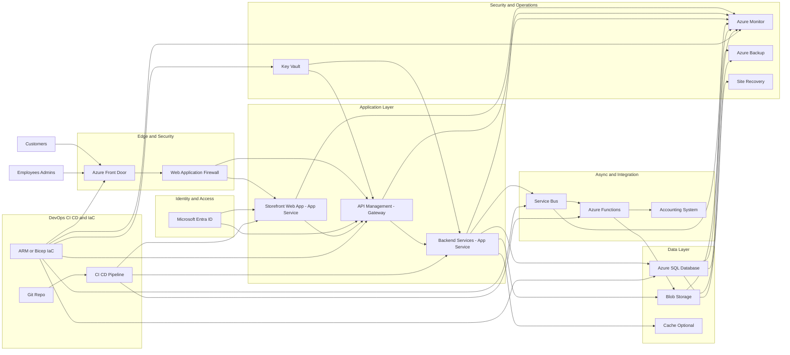

# assignment2_cloudcomputing_diagram

```mermaid
flowchart LR

%% USERS
U[Customers] --> FD
E[Employees Admins] --> FD

%% EDGE
subgraph Edge[Edge and Security]
FD[Azure Front Door] --> WAF[Web Application Firewall]
end

WAF --> WEB
WAF --> APIM

%% IDENTITY
subgraph Identity[Identity and Access]
ENTRA[Microsoft Entra ID]
end

ENTRA --> WEB
ENTRA --> APIM

%% APP
subgraph App[Application Layer]
WEB[Storefront Web App - App Service] --> APIM[API Management - Gateway]
APIM --> SVC[Backend Services - App Service]
end

%% DATA
subgraph Data[Data Layer]
SQL[Azure SQL Database]
BLOB[Blob Storage]
CACHE[Cache Optional]
end

SVC --> SQL
SVC --> BLOB
SVC --> CACHE

%% INTEGRATION
subgraph Integration[Async and Integration]
SB[Service Bus] --> FUNC[Azure Functions]
ACC[Accounting System]
end

SVC --> SB
FUNC --> BLOB
FUNC --> ACC

%% OPS
subgraph Ops[Security and Operations]
KV[Key Vault]
MON[Azure Monitor]
BAK[Azure Backup]
DR[Site Recovery]
end

KV --> SVC
KV --> APIM

WEB --> MON
APIM --> MON
SVC --> MON
SQL --> MON
SB --> MON
BLOB --> MON

SQL --> BAK
BLOB --> BAK
SQL --> DR

%% DEVOPS
subgraph DevOps[DevOps CI CD and IaC]
GIT[Git Repo] --> PIPE[CI CD Pipeline]
IAC[ARM or Bicep IaC]
end

PIPE --> WEB
PIPE --> SVC
PIPE --> FUNC

IAC --> FD
IAC --> APIM
IAC --> SQL
IAC --> SB
IAC --> KV
IAC --> MON
```
